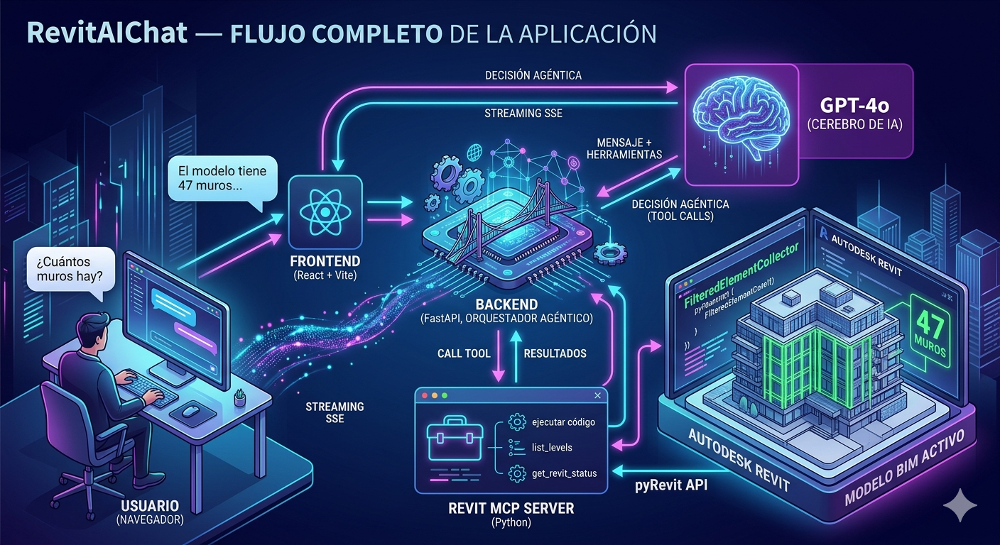

# Revit AI Chat

App web con agente IA que se conecta a Revit a través de MCP.

```
[React + Tailwind :5173]
        ↕ HTTP + SSE
[FastAPI Backend  :8001]  ←→  [Anthropic API (Claude)]
        ↕ MCP SSE client
[Revit MCP Server :8000]  ←→  [Revit via pyRevit Routes :48884]
```

---



## Requisitos previos

- Python 3.11+ con `uv` instalado
- Node.js 18+
- Revit abierto con pyRevit instalado y corriendo
- API key de Anthropic

---

## 1. Arrancar el MCP de Revit

```bash
# En tu directorio del MCP
uv run main_http.py
# → Listening on http://0.0.0.0:8000
```

---

## 2. Backend (FastAPI)

```bash
cd backend

# Instalar dependencias
pip install -r requirements.txt
# o con uv:
uv pip install -r requirements.txt

# Configurar variables de entorno
cp .env.example .env
# Edita .env y añade tu ANTHROPIC_API_KEY

# Arrancar en el puerto 8001
python run.py
```

El backend expone:
- `GET  /health`      → Health check
- `GET  /mcp/tools`   → Lista de tools disponibles del MCP
- `POST /chat`        → Endpoint de chat (streaming SSE)

---

## 3. Frontend (React + Tailwind)

```bash
cd frontend

npm install
npm run dev
# → http://localhost:5173
```

---

## Uso

1. Abre Revit con un proyecto cargado
2. Asegúrate de que el MCP corre en `:8000`
3. Arranca el backend en `:8001`
4. Arranca el frontend en `:5173`
5. Abre http://localhost:5173

---

## Variables de entorno (backend/.env)

| Variable          | Descripción                         | Default                        |
|-------------------|-------------------------------------|--------------------------------|
| `ANTHROPIC_API_KEY` | Tu API key de Anthropic           | (requerida)                    |
| `MCP_SERVER_URL`    | URL SSE del servidor MCP de Revit | `http://localhost:8000/sse`    |

---

## Estructura del proyecto

```
revit-chat-app/
├── backend/
│   ├── main.py          # FastAPI + agente Claude + MCP client
│   ├── run.py           # Entry point (carga .env, arranca uvicorn)
│   ├── requirements.txt
│   └── .env.example
└── frontend/
    ├── src/
    │   ├── App.jsx
    │   ├── index.css
    │   ├── main.jsx
    │   └── components/
    │       └── ChatBox.jsx   # Chat UI completo
    ├── index.html
    ├── package.json
    ├── tailwind.config.js
    ├── postcss.config.js
    └── vite.config.js
```

---

## Cómo funciona el agente

1. El usuario envía un mensaje
2. El backend obtiene las tools disponibles del MCP
3. Claude decide qué tools usar y las ejecuta en un loop agentico
4. Cada tool call se envía al MCP de Revit vía SSE
5. Los resultados se devuelven a Claude para generar la respuesta final
6. Todo se hace streaming via SSE al frontend
